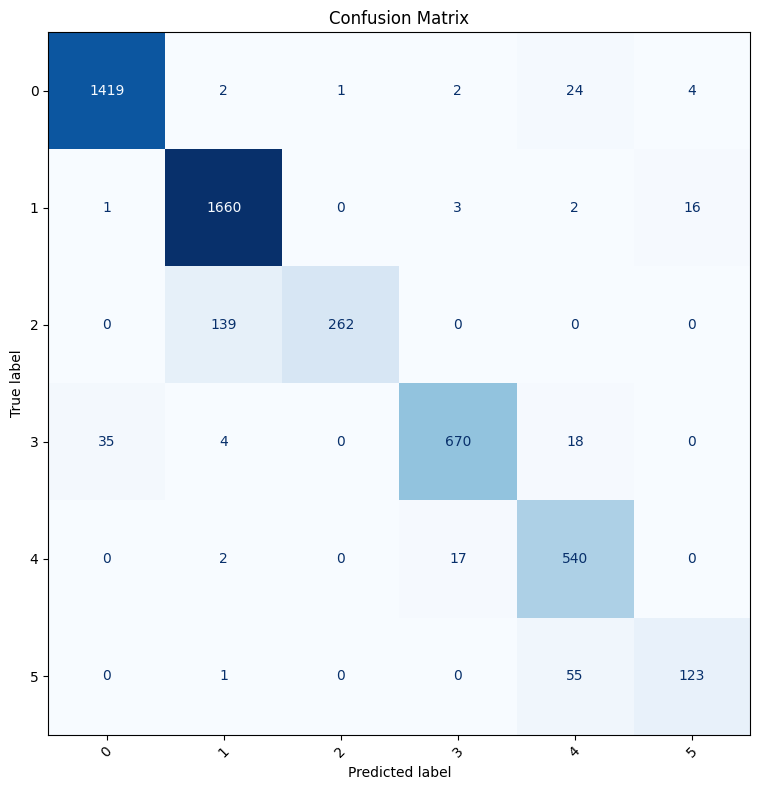

# 🧠 AI Mental Health Assistant

<div align="center">


**An AI-powered emotion detection system with CBT-based supportive responses.**  
Built using a fine-tuned DistilBERT model and a modern dark glassmorphism Streamlit UI.

</div>

---

## ✨ Features

| Feature | Description |
|---|---|
| 🔍 **Emotion Detection** | DistilBERT fine-tuned on 6 emotion classes |
| 📊 **Confidence Score** | Shows prediction confidence as a percentage |
| 📈 **Probability Chart** | Interactive Plotly horizontal bar chart for all emotions |
| ⚡ **Inference Time** | Displays model latency in milliseconds |
| 🧠 **CBT Responses** | 5 unique CBT-based supportive responses per emotion |
| 🕓 **Conversation History** | Full session history with timestamps |
| ⬇️ **Download History** | Export chat as a formatted `.txt` file |
| 🌙 **Dark Mode UI** | Glassmorphism dark theme with gradient accents |
| 🛡️ **Error Handling** | Graceful handling of empty input, missing files, and load failures |

---

## 🎭 Supported Emotions

| Emotion | Emoji | Colour |
|---|---|---|
| Sadness  | 😢 | Blue   |
| Joy      | 😊 | Yellow |
| Love     | ❤️  | Red    |
| Anger    | 😡 | Orange |
| Fear     | 😨 | Purple |
| Surprise | 😲 | Teal   |

---

## 📁 Project Architecture

```
Emotion_classifier/
│
├── app.py                  # Main Streamlit application (entry point)
├── utils.py                # Model loading, inference, CBT helpers
├── responses.json          # CBT responses (5 per emotion)
├── requirements.txt        # Python dependencies
├── README.md               # Project documentation
│
├── finalmodels/            # Saved DistilBERT model (do NOT modify)
│   ├── config.json
│   ├── tf_model.h5
│   ├── tokenizer.json
│   ├── tokenizer_config.json
│   ├── special_tokens_map.json
│   ├── vocab.txt
│   └── label_encoder (2).pkl
│
└── assets/
    └── style.css           # Custom dark glassmorphism stylesheet
```

---

## 🚀 Installation & Local Setup

### 1. Clone / Download the Project

```bash
git clone https://github.com/karthikraja/emotion-classifier.git
cd emotion-classifier
```

### 2. Create a Virtual Environment (recommended)

```bash
# Windows
python -m venv venv
venv\Scripts\activate

# macOS / Linux
python3 -m venv venv
source venv/bin/activate
```

### 3. Install Dependencies

```bash
pip install -r requirements.txt
```

> **Note:** TensorFlow installation may take a few minutes. GPU support requires CUDA-compatible drivers.

### 4. Verify Model Files

Ensure the `finalmodels/` directory contains all of the following:

```
finalmodels/
├── config.json
├── tf_model.h5
├── tokenizer.json
├── tokenizer_config.json
├── special_tokens_map.json
├── vocab.txt
└── label_encoder (2).pkl
```

### 5. Run the Application

```bash
streamlit run app.py
```

The app will open automatically at **http://localhost:8501**

---

## 🖥️ Screenshots

> _Add screenshots here after running the application._

| Home Page | Analysis Result |
|---|---|
|  |  |

---

## 🧠 Model Details

| Property | Value |
|---|---|
| **Base Architecture** | `distilbert-base-uncased` |
| **Framework** | TensorFlow 2.x |
| **Fine-tuning Task** | Multi-class Sequence Classification |
| **Number of Classes** | 6 (sadness, joy, love, anger, fear, surprise) |
| **Max Token Length** | 128 |
| **Accuracy** | **93.48%** |
| **Precision** | 93.80% |
| **Recall** | 93.48% |
| **F1 Score** | 93.23% |

### 📈 Model Performance Visualization

The following confusion matrix demonstrates the fine-tuned DistilBERT model's performance across the 6 emotion classes on the validation dataset:



---

## 🔄 Application Flow

```
User Input (text)
      │
      ▼
Tokenization (DistilBertTokenizerFast)
      │
      ▼
DistilBERT Forward Pass (TF inference)
      │
      ▼
Softmax → Probabilities (6 classes)
      │
      ├──► Predicted Emotion + Confidence
      ├──► Plotly Probability Chart
      └──► Random CBT Response (from responses.json)
```

---

## 💬 CBT Response System

Each of the 6 emotion classes has **5 unique CBT-based responses** stored in `responses.json`.  
On each analysis, one is selected at random, providing variety across repeated uses.

CBT techniques employed include:
- **Cognitive restructuring** — identifying and challenging negative thoughts
- **Grounding exercises** — 5-4-3-2-1 sensory technique
- **Breathing regulation** — box breathing / diaphragmatic breathing
- **Behavioural activation** — small positive steps
- **Gratitude journaling** — positivity bank technique
- **Savoring** — amplifying positive emotions

---

## ⚠️ Disclaimer

> This application is built for **educational and demonstration purposes only**.  
> It is **not** a substitute for professional mental health care.  
> If you or someone you know is in distress, please contact a licensed mental health professional or a crisis helpline.

---

## 🔮 Future Improvements

- [ ] Real-time emotion tracking across a session with a trend line chart
- [ ] Voice input support using `SpeechRecognition`
- [ ] Multi-language emotion detection
- [ ] User authentication and persistent history (SQLite / Firebase)
- [ ] REST API backend using FastAPI for mobile app integration
- [ ] Therapist recommendation module based on detected emotion patterns
- [ ] Integration with wearable biosensor data (HR, HRV)
- [ ] Fine-tune on domain-specific mental health corpora

---

## 🧑‍💻 Developer

**Karthik Raja**  
AI / ML Engineer  
[](https://github.com/karthikraja)
[](https://linkedin.com/in/karthikraja)

---

## 📄 License

This project is licensed under the **MIT License** — see [LICENSE](LICENSE) for details.

---

<div align="center">
Built with ❤️ using DistilBERT · TensorFlow · HuggingFace · Streamlit
</div>
